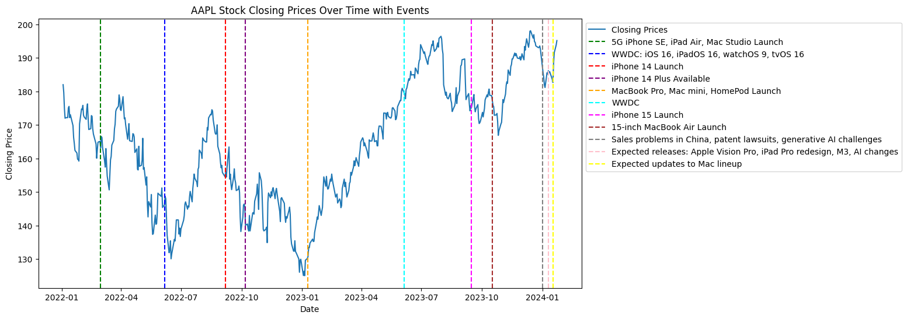
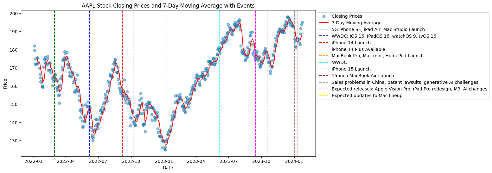
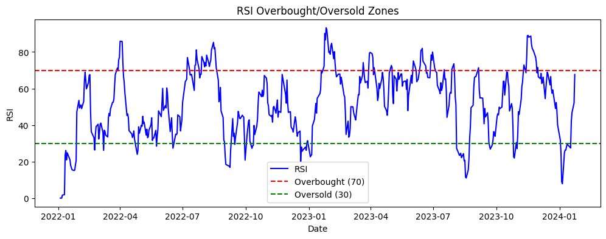
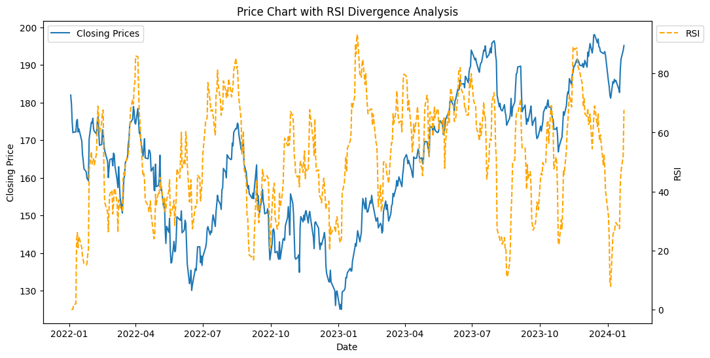
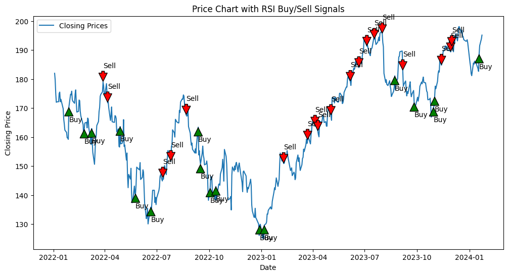
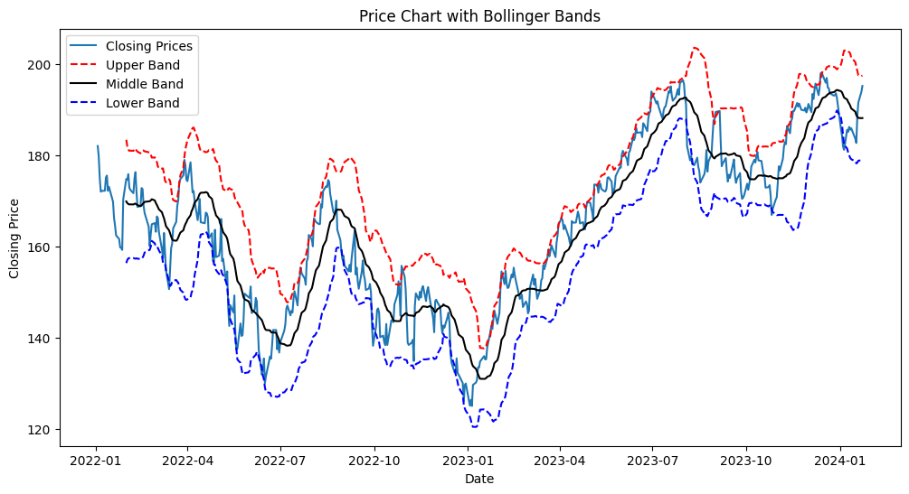
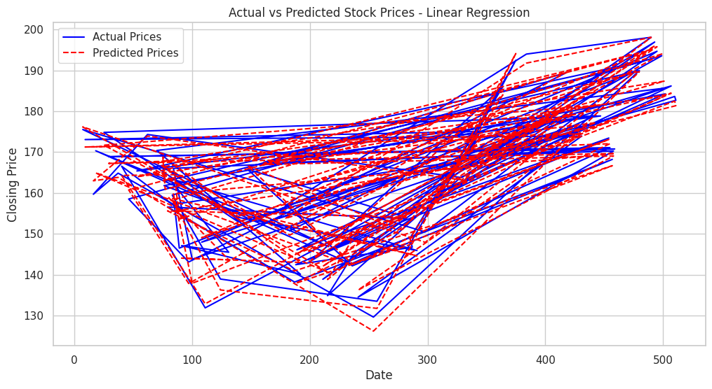

# 🍏 Apple Stock Price Analysis and Prediction

This project explores **Apple Inc. (AAPL)** stock price data from Yahoo Finance to analyze historical performance and forecast future prices using Python. Alongside predictive modeling, it introduces and applies a variety of **financial concepts** and **technical indicators**. 

> 🧠 Full analysis in: `Apple_Stock_Price_Analysis_and_Prediction.ipynb`

---

## 📌 Project Goals

- Analyze Apple's historical stock price trends
- Explore and apply financial indicators
- Build machine learning and time series models for forecasting
- Visualize market-moving events alongside price action
- Interpret results with respect to financial insights

---

## 🧠 Financial Concepts & Technical Indicators

This analysis covers a wide range of foundational and technical finance concepts:

- **Daily & Cumulative Returns**
- **Moving Averages (7-Day SMA/EMA)**
- **Bollinger Bands** – for volatility and trend strength
- **RSI (Relative Strength Index)** – for identifying overbought/oversold conditions
- **RSI Divergence** – as an early signal for potential reversals
- **Buy/Sell Signals** based on RSI thresholds
- **Event Impact Mapping** – overlaying stock events (launches, keynotes, macroeconomic news) on price charts

---

## 🔍 Methodology

1. **Data Acquisition**  
   - Historical stock prices were fetched using the `yfinance` library for the ticker symbol `AAPL`.

2. **Exploratory Data Analysis (EDA)**  
   - Time series visualization
   - Volume vs price exploration
   - Event annotation on timelines

3. **Feature Engineering**  
   - Rolling mean/volatility
   - RSI computation
   - Bollinger Band levels
   - Lag features and shifted targets for modeling

4. **Modeling Techniques**  
   - **Linear Regression**
     - Used to predict future prices based on engineered features
     - Evaluated using RMSE and visual comparison
   - **ARIMA (AutoRegressive Integrated Moving Average)**
     - Applied to model stock price time series
     - Useful for understanding autocorrelation and trends
   - *[LSTM or Prophet models can be added later for deeper forecasting]*

5. **Visualization**  
   - Trends, seasonality, and volatility explored via plots
   - RSI signals and buy/sell decisions visualized
   - Forecast vs actual line plots

---

## 🛠 Tech Stack

- **Languages**: Python 3
- **Data**: Yahoo Finance API (via `yfinance`)
- **Libraries**:
  - `pandas`, `numpy` – data handling
  - `matplotlib`, `seaborn` – visualization
  - `scikit-learn` – regression modeling
  - `statsmodels` – ARIMA time series
  - `yfinance` – stock data retrieval

---

## 📈 Key Visual Results

### 1. **Stock Closing Prices with Key Events**

---

### 2. **Closing Price with 7-Day Moving Average**

---

### 3. **RSI Overbought/Oversold Zones**

---

### 4. **Price Chart with RSI Divergence**

---

### 5. **RSI Buy/Sell Signal Chart**

---

### 6. **Bollinger Bands Visualization**

---

### 7. **Actual vs Predicted Prices (Linear Regression)**

---

## 📊 Results Summary

- RSI strategy offered simple but interpretable trading signals
- Bollinger Bands and moving averages captured market volatility
- Linear regression predicted short-term price movements with reasonable accuracy
- ARIMA modeling showed autocorrelation in Apple stock trends
- Product events (like iPhone/Mac launches) visibly impacted price trends

---

## 🚀 Future Enhancements

- Integrate LSTM or Prophet for better sequence modeling
- Add Sharpe ratio, max drawdown, and risk-adjusted metrics
- Deploy this as a Streamlit app for live stock data analysis
- Add portfolio-level metrics and simulate investment returns

---

## 📚 References

- [Yahoo Finance API via yfinance](https://pypi.org/project/yfinance/)
- [Investopedia – Financial Concepts](https://www.investopedia.com/)
- [scikit-learn documentation](https://scikit-learn.org/)
- [Statsmodels for Time Series](https://www.statsmodels.org/)
